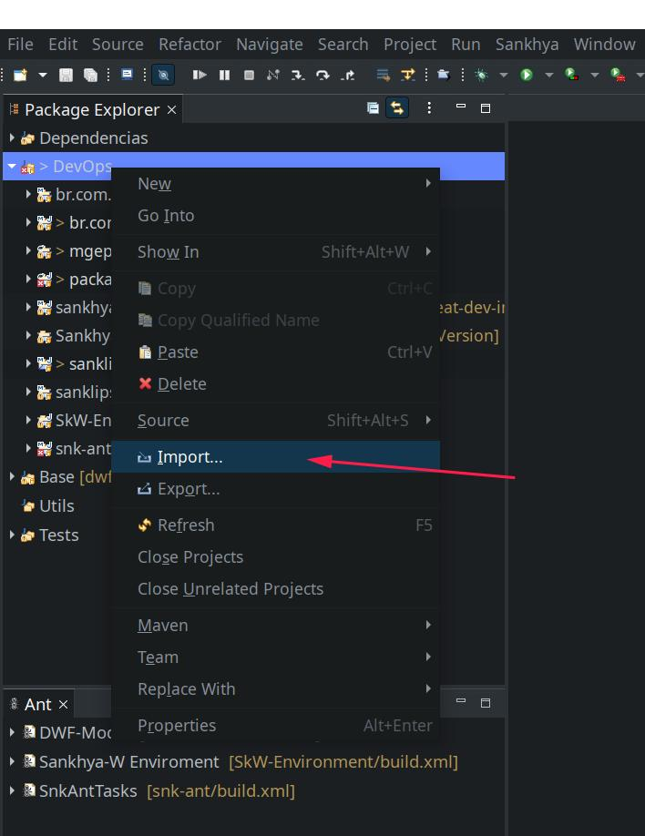
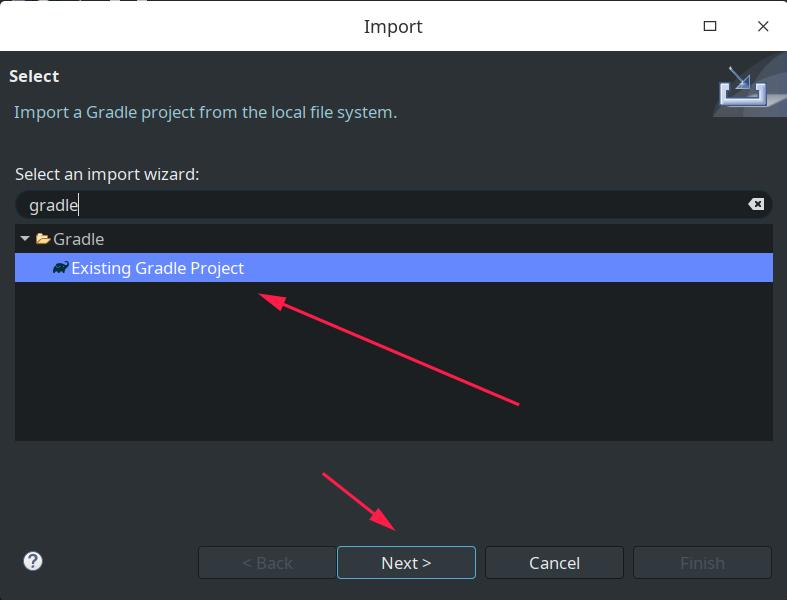
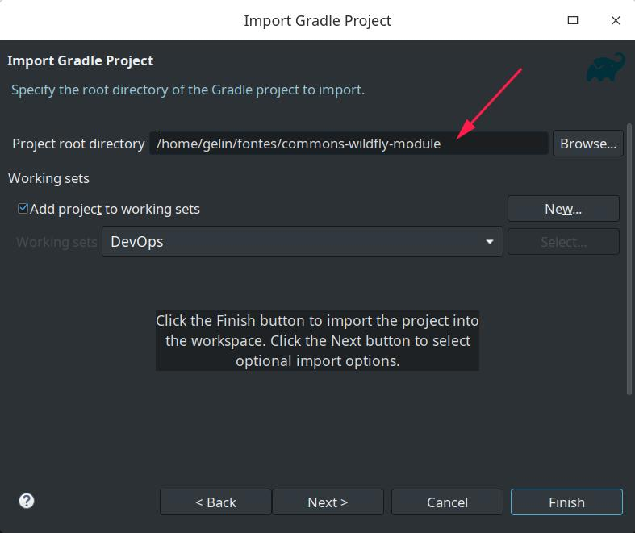
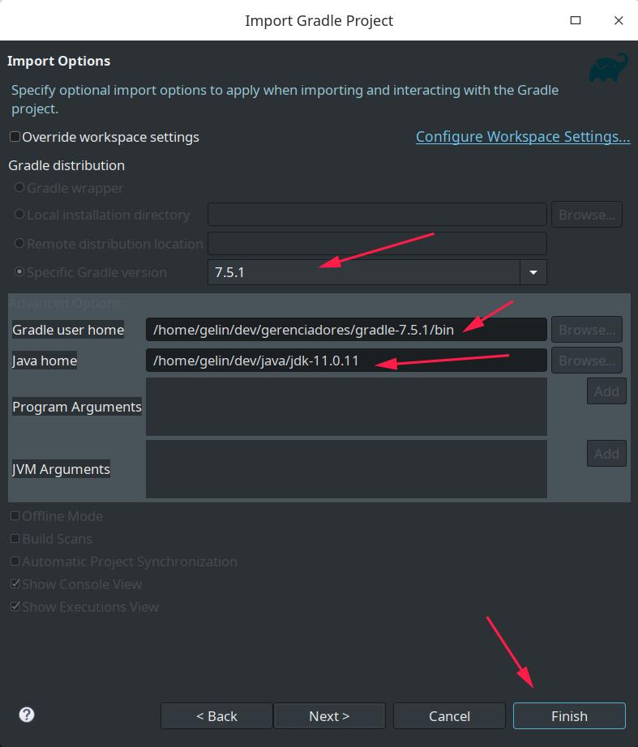
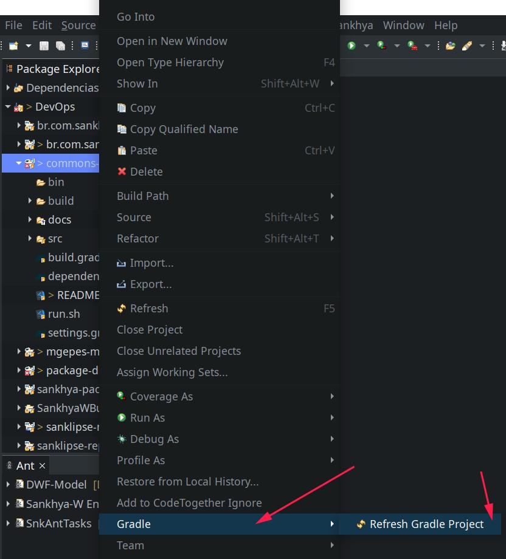
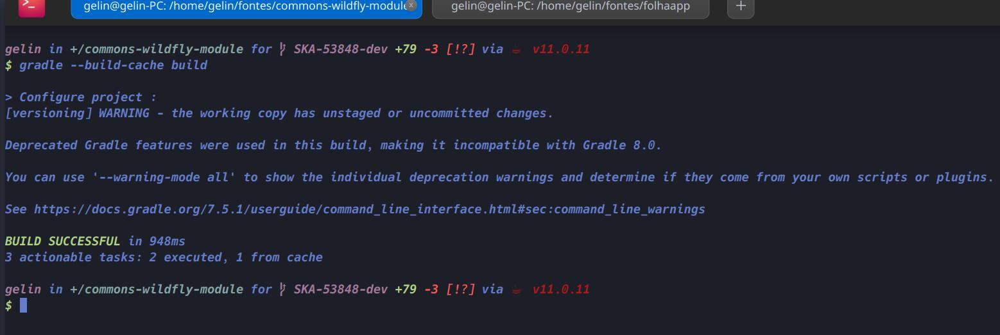
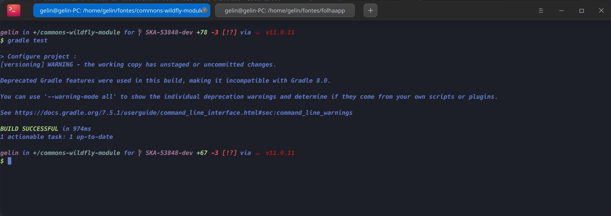

# Projeto A

## 🚀 Começando

**Problema**: Utilizar o wildfly para publicar uma aplicação Java EE tem suas vantagens e oferece uma gama de comodidades no desenvolvimento. Porém, temos a limitação de ser uma aplicação web utilizando os recursos disponibilizados por um servidor de aplicação.

**Solução**: Criar um projeto/extensão que reune e soluciona os problemas comuns entre as aplicações group ao utilizar o wildfly.

## ✒️ Autores
> **DevOps** - [Email](devops@group.com.br) 

## 📋 Requisitos / Tecnologias
- Eclipse 2022
- Java 1.8
- Maven 7.5.1
- skw-environment:master
- undertow-core:2.2.5.Final
- jboss-logging:3.4.0.Final
- mockito-core:3.3.3
- junit:4.13.1
  
## 🔧 Instalação

1. Clonar este projeto
    ```bash
    git clone https://git.group.com.br/erp/libraries/commons-wildfly-module.git
    ```
2. Importar projeto no eclipse como gradle, seguindo o passo a passo abaixo.

> 

>

>

>

## ⚙️ Atualizar e rebuildar projeto

1. Botão direito em cima do projeto, selecionar gradle e clicar em 'Refresh Gradle Projet' como na imagem abaixo.

>

## 🎬 Gerar artefatos locais
1. Para gerar o jar locamente, basta abrir um terminal na pasta do projeto e digitar o comando abaixo.
   
    ```bash
    gradle build
    ```
ou caso tenha permissão para fazer publicações, poderá utilizar o script 'run.sh' com o comando abaixo. *OBS: é necessário passar a versão que está compilando e o nome do repositório para onde quer publicar. Além disso, deverá ter nas variáveis de ambiente, as credenciais do nexus.

```bash
run.sh develop maven-snapshots
```

> 

## 🎬 Rodar testes locais
1. Abrir um terminal na pasta do projeto e digitar o comando abaixo.
   
   ```bash
   gradle test
   ```

> 
